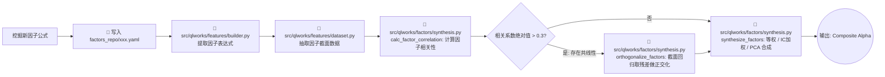
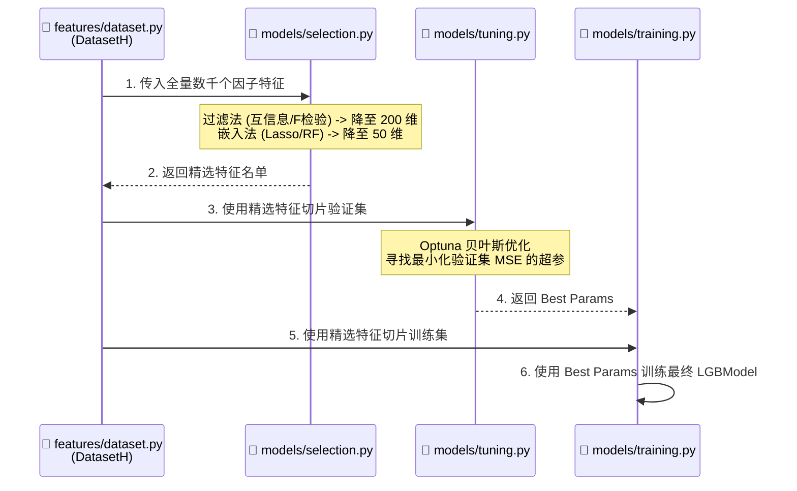

# Qlibworks 机器学习多因子量化研究操作指引

## 1. 文档目标

本文档用于指导 `Qlibworks` 项目内的机器学习多因子量化研究流程落地，重点覆盖以下三大阶段：

1. 数据层：数据接入、缓存、清洗、质量评估。
2. 特征层：标准因子集、自定义因子、数据集封装。
3. 模型层：训练、评估、预测目标股生成。

本文同时对照 `e:\Quant\量化学习\qlib量化分析课程\code` 中的课程示例，将课程知识映射到本项目的工程化实现。

## 2. 项目结构建议

当前项目围绕“研究层 + 执行层”组织：

```text
src/qlworks/
  config.py                  # 路径与全局配置
  duckdb_adapter.py          # DuckDB 原始 OHLCV 适配
  workflow.py                # 研究工作流编排
  data/
    access.py                # Qlib 数据访问
    cleaning.py              # 数据清洗
    quality.py               # 数据质量评估
  features/
    builder.py               # 特征与标签配置
    dataset.py               # DatasetH / Alpha158 / Alpha360 封装
  factors/
    manager.py               # YAML 因子库管理 (支持多文件合并)
    synthesis.py             # 因子正交化与合成 (等权、IC加权、PCA)
  models/
    training.py              # 模型训练 (LightGBM, XGBoost, CatBoost, LSTM等)
    selection.py             # 特征选择 (过滤法、包装法、嵌入法)
    tuning.py                # 自动超参寻优 (Optuna)
    evaluation.py            # 预测评估 (IC / RankIC / 目标股筛选)
    portfolio.py             # Barra 风格均值-方差组合优化
  processors/
    neutralize.py            # 行业/市值截面中性化
  backtest/
    bt_strategy.py           # Backtrader 策略模板
    bt_runner.py             # Backtrader 回测执行器
```

## 3. 核心流程图

### 3.1 全链条研究工作流 (End-to-End Workflow)

整个 Qlibworks 机器学习多因子管线的宏观数据流与操作顺序：

```mermaid
graph TD
    A[(底层数据 DuckDB/CSV)] -->|src/qlworks/duckdb_adapter.py| B(Qlib Bin 格式数据)
    B --> C[📄 src/qlworks/data/access.py<br/>拉取基础行情特征]
    C --> D[📄 src/qlworks/data/cleaning.py<br/>MAD去极值, 缺失值填充]
    D --> E[📄 src/qlworks/data/quality.py<br/>质量体检报告]
    
    E --> F[📄 src/qlworks/features/builder.py<br/>解析因子配置]
    Y[(📁 factors_repo/*.yaml<br/>YAML因子库)] -.->|单文件/多文件合并| F
    
    F --> G[📄 src/qlworks/features/dataset.py<br/>构建 DatasetH]
    G -->|内置| H[📄 src/qlworks/processors/neutralize.py<br/>截面标准化/行业市值中性化]
    
    H --> I{📄 src/qlworks/models/selection.py<br/>特征选择?}
    I -->|是 (如 Lasso 降维)| J[提取 Top N 精选因子名单]
    I -->|否| K
    J --> K[📄 src/qlworks/models/tuning.py<br/>Optuna 超参寻优]
    
    K --> L[📄 src/qlworks/models/training.py<br/>训练 LightGBM/CatBoost/LSTM]
    L --> M[📄 src/qlworks/models/evaluation.py<br/>预测与 IC/RankIC 体检]
    
    M --> N[📄 src/qlworks/models/portfolio.py<br/>Barra均值-方差组合优化]
    N --> O((输出: 优化后的每日持仓权重))
    O --> P[📄 src/qlworks/backtest/bt_runner.py<br/>Backtrader 历史回测]

    classDef data fill:#e1f5fe,stroke:#3182bd,stroke-width:2px;
    classDef feature fill:#fff3e0,stroke:#0288d1,stroke-width:2px;
    classDef model fill:#e8f5e9,stroke:#388e3c,stroke-width:2px;
    classDef execute fill:#fce4ec,stroke:#c2185b,stroke-width:2px;
    
    class A,B,C,D,E data;
    class F,Y,G,H feature;
    class I,J,K,L,M model;
    class N,O,P execute;
```

### 3.2 专题一：因子开发与正交合成流

在纯因子挖掘（不跑机器学习）或多因子线性组合场景下的推荐流程：



### 3.3 专题二：特征选择与模型调优流

在应对成百上千个噪音因子时的机器学习训练范式：



## 4. 课程代码到项目模块的映射

### 3.1 数据层

- `chap02/qlib_data_access_demo.py`
  - 对应：`src/qlworks/data/access.py`
  - 作用：初始化 Qlib、读取交易日历、股票池、基础特征。

- `chap02/qlib_cache_mechanism_demo.py`
  - 对应：研究习惯要求，不单独封装模块。
  - 作用：提示在 `D.features` 查询中尽量使用批量区间访问，充分利用 Qlib 缓存。

- `chap02/qlib_data_clean_demo.py`
  - 对应：`src/qlworks/data/cleaning.py`
  - 作用：处理缺失值、异常值、成交量合法性。

- `chap02/qlib_data_evaluation_demo.py`
  - 对应：`src/qlworks/data/quality.py`
  - 作用：生成完整性、一致性、时效性、异常值报告。

### 3.2 特征层

- `chap02/qlib_feature_engineering_demo.py`
  - 对应：`src/qlworks/features/builder.py`
  - 作用：沉淀常见价量特征、波动率特征、价量相关特征。

- `chap02/qlib_alpha_datasets_demo.py`
  - 对应：`src/qlworks/features/dataset.py`
  - 作用：统一 Alpha158 / Alpha360 的 handler 与 `DatasetH` 创建逻辑。

- `chap02/qlib_custom_handler_demo.py`
  - 对应：`src/qlworks/factors/manager.py` + `src/qlworks/processors/neutralize.py`
  - 作用：支持自定义因子、行业轮动、中性化等扩展。

### 3.3 模型层

- `chap03/lightgbm_basic_demo.py`
  - 对应：`src/qlworks/models/training.py`
  - 作用：建立基线 LightGBM 模型。

- `chap03/lstm_model_demo.py`
  - 对应：项目后续可扩展的深度学习路线。
  - 作用：说明 `Alpha360` 和高维特征更适合深度学习模型。

- `chap04/model_training_pipeline_demo.py`
  - 对应：`src/qlworks/workflow.py`
  - 作用：把数据准备、训练、评估串成研究流水线。

- `chap04/model_evaluation_demo.py`
  - 对应：`src/qlworks/models/evaluation.py`
  - 作用：计算 IC、RankIC、正 IC 比例等核心指标。

- `chap04/feature_selection_demo.py`
  - 对应：`src/qlworks/models/selection.py`
  - 作用：过滤法、包装法、嵌入法的特征筛选与统一调度。

## 4. 标准研究流程

### 第一步：准备底层数据

如果数据还在本地 DuckDB 中：

1. 用 `src/qlworks/duckdb_adapter.py` 检测并导出标准 OHLCV。
2. 若要进入 Qlib 生态，继续使用现有 `scripts/build_qlib_from_duckdb.py` 将数据转为 Qlib 二进制目录。
3. 在 `src/qlworks/config.py` 中确认：
   - `DUCKDB_PATH`
   - `QLIB_DATA_DIR`

### 第二步：初始化并访问数据

建议入口：

```python
from qlworks.data import DataFetchSpec, QlibDataAccessor

accessor = QlibDataAccessor()
spec = DataFetchSpec(
    instruments="csi300",
    fields=["$close", "$volume", "Mean($close, 5)"],
    start_time="2020-01-01",
    end_time="2020-12-31",
)
df = accessor.fetch_features(spec)
```

实践建议：

- 尽量整段时间批量拉取，不要按天碎片化请求。
- 统一使用日频研究底表，减少频率错配。
- 股票池建议优先使用 `csi300` / `all` / 显式股票列表三种形式之一。

### 第三步：清洗与体检

```python
from qlworks.data import clean_ohlcv_data, generate_data_quality_report

clean_df = clean_ohlcv_data(df)
report = generate_data_quality_report(clean_df)
```

需要重点看四项：

1. 完整性：缺失值比例是否过高。
2. 一致性：OHLC 逻辑是否异常，成交量是否为负。
3. 时效性：日期是否连续，数据是否长时间断更。
4. 异常值：是否有异常跳点影响因子分布。

### 第四步：构建特征与标签

#### 路线 A：快速原型

```python
from qlworks.features import build_alpha_feature_bundle

bundle = build_alpha_feature_bundle()
```

适用场景：

- 快速验证一个研究想法。
- 与课程 `qlib_feature_engineering_demo.py` 保持一致。

#### 路线 B：因子库驱动 (支持多库融合)

```python
from qlworks.features import build_factor_library_bundle

# 加载单个库
bundle1 = build_factor_library_bundle("master_factor_dictionary")

# 融合多个库 (自动去重)
bundle2 = build_factor_library_bundle([
    "alpha158_factor_dictionary", 
    "weekly_reversal_v1"
])
```

适用场景：

- 因子表达式来自 YAML 配置。
- 想把策略思路、因子说明、Qlib 表达式统一管理。
- 需要将动量因子库和估值因子库合并送给机器学习。

### 第五步：生成数据集

#### 传统机器学习

```python
from qlworks.features import create_alpha158_dataset

handler, dataset = create_alpha158_dataset(
    instruments="csi300",
    start_time="2020-01-01",
    end_time="2020-12-31",
    fit_start_time="2020-01-01",
    fit_end_time="2020-06-30",
)
```

适用模型：

- LightGBM
- XGBoost
- CatBoost
- 线性模型

#### 深度学习

```python
from qlworks.features import create_alpha360_dataset

handler, dataset = create_alpha360_dataset(
    instruments="csi300",
    start_time="2020-01-01",
    end_time="2020-12-31",
)
```

适用模型：

- LSTM
- MLP
- Transformer 类模型

### 第六步：模型调优与训练

#### Optuna 自动超参寻优 (新增特性)

金融数据极易过拟合，使用写死的超参数训练是非常危险的。
强烈建议在正式训练前，使用 Optuna 进行贝叶斯优化：

```python
from qlworks.models import tune_lgbm_hyperparameters

# 自动在验证集上寻找最优参数
best_params = tune_lgbm_hyperparameters(dataset, n_trials=20)
print(f"最优超参: {best_params}")
```

#### LightGBM 正式模型

```python
from qlworks.models import train_lgb_model

# 拿着最佳超参拟合全量数据
model = train_lgb_model(dataset, **best_params)
pred = model.predict(dataset, segment="test")
```

建议：
先跑小规模数据不带调参验证基线，确认没有 BUG 后，再开启 Optuna。

### 第六步补充：执行正式特征选择

课程中的三类方法已经在项目中工程化到 `src/qlworks/models/selection.py`。

#### 过滤法

适用场景：

- 因子很多，需要快速删除弱信息特征。
- 希望先做第一轮粗筛，再进入更复杂的方法。

```python
from qlworks.models import (
    prepare_feature_selection_data,
    filter_feature_selection,
    apply_feature_selection,
)

x_train, y_train, x_test = prepare_feature_selection_data(
    train_frame=frames["train"],
    test_frame=frames["test"],
)
result = filter_feature_selection(x_train, y_train, method="f_regression", k=50)
selected_x_train, selected_x_test = apply_feature_selection(result, x_train, x_test)
```

支持：

- `f_regression`
- `mutual_info`

#### 包装法

适用场景：

- 希望让模型迭代挑选最优特征子集。
- 已完成粗筛，准备做第二轮精选。

```python
from qlworks.models import wrapper_feature_selection, apply_feature_selection

result = wrapper_feature_selection(x_train, y_train, n_features=30)
selected_x_train, selected_x_test = apply_feature_selection(result, x_train, x_test)
```

默认使用：

- `LinearRegression + RFE`

#### 嵌入法

适用场景：

- 想在模型训练过程中同步完成特征压缩。
- 同时关注线性稀疏性与非线性特征重要性。

```python
from qlworks.models import embedded_feature_selection

lasso_result = embedded_feature_selection(x_train, y_train, method="lasso", threshold=0.01)
rf_result = embedded_feature_selection(
    x_train,
    y_train,
    method="random_forest",
    threshold=0.001,
)
```

支持：

- `lasso`
- `random_forest`

#### 统一调度入口

```python
from qlworks.models import select_features

result = select_features(x_train, y_train, method="filter", k=50)
```

推荐顺序：

1. 先过滤法，把特征从高维压缩到中等规模。
2. 再用包装法或嵌入法做第二轮精筛。
3. 最后将入选特征送入 LightGBM、CatBoost 或深度学习模型。

### 第七步：评估模型

```python
import pandas as pd
from qlworks.models import evaluate_prediction_frame

test_frame = dataset.prepare("test")
pred_frame = pd.DataFrame(
    {"pred": pred.values.flatten(), "label": test_frame["LABEL0"].values},
    index=test_frame.index,
).dropna()

metrics = evaluate_prediction_frame(pred_frame)
```

核心指标解释：

- `IC`：预测值与未来收益的线性相关。
- `RankIC`：排序相关，更适合截面选股。
- `IC Mean / IC Std`：衡量稳定性。
- `IC Positive Rate`：正向有效天数比例。

### 第七步补充：在工作流中调用特征选择

`workflow.py` 已补充研究流水线级别的入口：

```python
from qlworks.workflow import MLFactorResearchWorkflow

workflow = MLFactorResearchWorkflow()
selection_result = workflow.select_dataset_features(
    dataset,
    method="embedded",
    threshold=0.001,
)
```

该入口会：

1. 仅使用训练集拟合选择器。
2. 将筛选结果同步应用到测试集。
3. 返回被选特征数与特征名单，便于记录实验结果。

### 第八步：组合优化与生成目标股清单 (Barra 风格)

传统的选股方法只是简单按模型得分截面取 Top-K，这会忽略个股间的相关性和风险敞口：

```python
from qlworks.models import select_top_instruments
# (传统) 暴力取前 20 只股票，等权重
daily_top = select_top_instruments(pred, top_k=20)
```

**推荐使用：均值-方差组合优化器 (Barra 风格)**
引入 `portfolio.py`，让 PyPortfolioOpt 在满足目标波动率约束下最大化预期收益：

```python
from qlworks.models import optimize_portfolio

# 提取最新一天的预测分和近期的历史收盘价
latest_date = pred.index.get_level_values('datetime').max()
latest_preds = pred.xs(latest_date, level='datetime')
prices_pivot = df['$close'].unstack('instrument')

weights = optimize_portfolio(
    prices_df=prices_pivot,
    predictions=latest_preds,
    target_volatility=0.15,  # 年化波动率控制在 15% 以内
    max_weight=0.10          # 单只股票上限 10%
)
# weights 即为最优资金配比
```

输出可直接传递给 `backtest.bt_runner.py`，由 Backtrader 执行订单。

## 5. 推荐的研究分层

### 5.1 数据层

职责：

- 原始数据统一接入。
- Qlib 查询封装。
- 数据质量体检。
- 清洗标准化。

不要在这一层做：

- 模型训练。
- 回测交易逻辑。

### 5.2 特征层

职责：

- 定义因子表达式。
- 选择 Alpha158 / Alpha360 / YAML 因子库。
- 组织标签定义。
- 组装 `DatasetH`。

不要在这一层做：

- 真实交易执行。
- 图形可视化页面逻辑。

### 5.3 模型层

职责：

- 模型训练。
- 预测评分。
- IC / RankIC / MSE 评估。
- 目标股列表输出。

不要在这一层做：

- DuckDB 原始表扫描。
- 前端可视化上传。

## 6. A 股场景建议

### 股票池

- 入门研究：`csi300`
- 扩展研究：`all`
- 行业轮动：显式传入行业或主题股票池

### 标签建议

- 日频短线：`Ref($close, -1) / $close - 1`
- 周频轮动：`Ref($close, -5) / $close - 1`
- 月频轮动：`Ref($close, -20) / $close - 1`

### 因子建议

- 基础价量：涨跌幅、量比、波动率
- 趋势类：均线、价格位置、突破强度
- 量价类：价量相关、量能放大
- 风格控制：行业、市值中性化

## 7. 模型建议

### 第一层：快速验证

- 线性回归
- LightGBM 小参数版本

目标：

- 验证特征是否有信息量。
- 验证标签定义是否合理。

### 第二层：正式研究

- LightGBM / CatBoost / XGBoost

目标：

- 获取稳定 IC。
- 做特征重要性分析。

### 第三层：高阶扩展

- LSTM / 深度学习模型
- 滚动训练
- 多模型集成

目标：

- 提高对时序结构和非线性关系的刻画能力。

## 8. 推荐实操顺序

1. 先确认 `QLIB_DATA_DIR` 与 `DUCKDB_PATH`。
2. 使用 `QlibDataAccessor` 拉取一个小样本。
3. 跑 `clean_ohlcv_data` + `generate_data_quality_report`。
4. 先用 `build_alpha_feature_bundle` 做小规模验证。
5. 再切换到 `Alpha158` 或 YAML 因子库。
6. 先做过滤法粗筛，再做包装法或嵌入法精筛。
7. 先训练线性基线，再训练 LightGBM。
8. 先看 IC / RankIC，再接回测。
9. 回测阶段再进入 `backtest` 模块。

## 9. 依赖安装建议

基础环境：

```bash
pip install -e .
```

研究环境：

```bash
pip install -e .[research]
```

深度学习环境：

```bash
pip install -e .[research,dl]
```

## 10. 下一步建议

如果继续增强项目，推荐按以下顺序迭代：

1. 增加 `models/deep_learning.py`，沉淀 LSTM 训练封装。
2. 增加 `workflow` 的滚动训练与滚动预测能力。
3. 把特征选择结果与 YAML 因子库联动，自动输出入选因子报告。
4. 把模型预测结果直接接入现有 `backtest` 模块，形成完整研究闭环。
